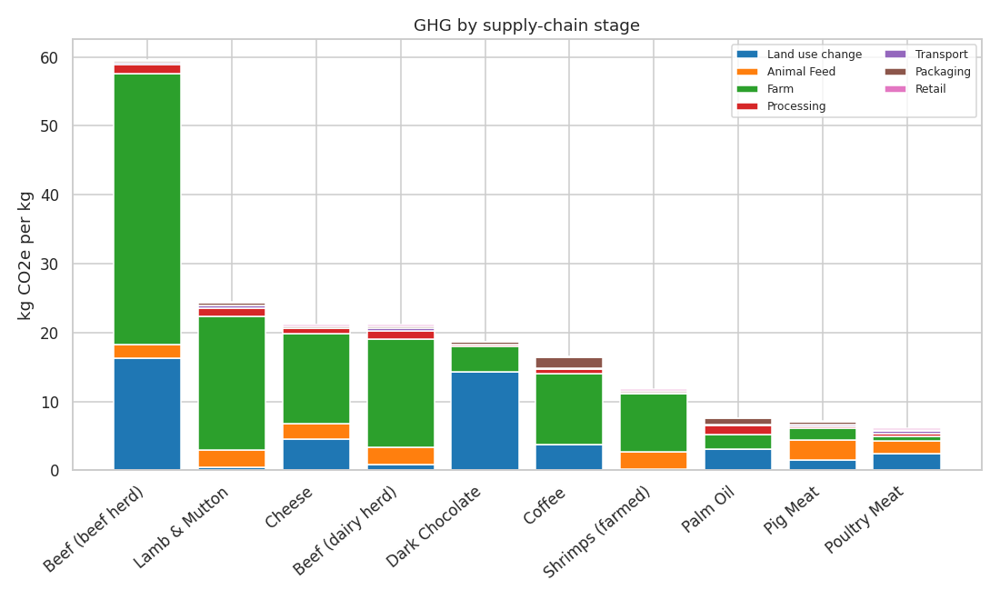
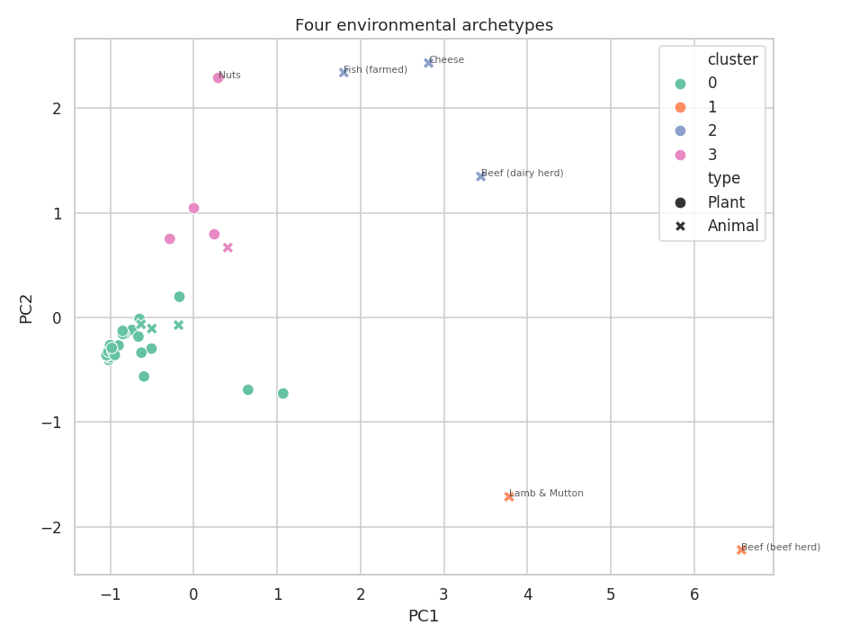
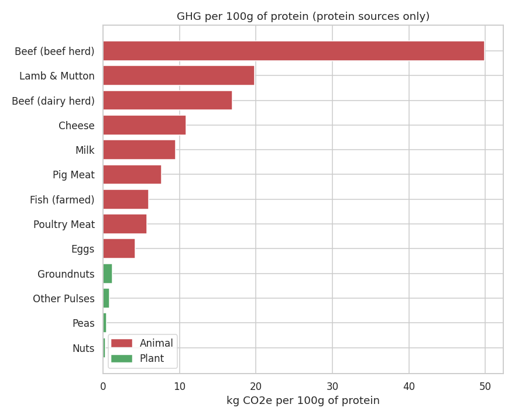

# Beyond the Average
### A multi-impact, supply-chain view of food's environmental footprint

A follow-up to **[The Carbon Footprint of Meat Demand](https://github.com/gbadedata/meat-carbon-footprint)**. That project reduced each meat type to a *single global carbon number* and named that as its main weakness. This one opens the number up - decomposing impact across the **supply chain**, widening from carbon to **five environmental measures**, and comparing foods on a **fair per-protein basis**.

---

## Key findings

- **The "food-miles" myth.** Transport + packaging are only **~5%** of animal-product emissions (0.5% for beef); the farm/feed/land block is ~90%. *What* you eat matters far more than how far it travelled.
- **Carbon is a decent proxy - except for water.** GHG correlates strongly with land (r=0.83) and eutrophication (r=0.76), but weakly with freshwater (r=0.33): a few *plants* (nuts, rice) are the thirstiest foods.
- **The animal/plant gap survives a fair comparison.** Even per 100g of protein, ruminant meat is ~50–100× the footprint of pulses or nuts; **eggs** are the most efficient animal protein.
- **Foods cluster into clear archetypes**, with beef and lamb isolated in an extreme high-impact, high-land corner.



---

## What this fixes - and what it doesn't

Project 1's limitations included **(a)** single global means hide producer-to-producer variation, and **(b)** the analysis was carbon-only and stopped at one farm-gate figure. It also flagged "add land and water" as a next step.

- ✅ **Addresses (b) and the land/water step** - GHG split by supply-chain stage, plus land, water and eutrophication, and a per-protein view.
- ❌ **Does *not* fix (a)** - the data here is still **per-product global means**. The producer-level distribution (best vs worst farm) needs percentile data that wasn't accessible for this build. That's the honest open problem, and a natural Project 3.

**A telling detail on (a):** Project 1 used Our World in Data's widely-cited **~99.5 kg CO₂e/kg** for beef; this dataset, summed across its stages, puts beef (beef herd) at **~60**. Same 2018 study - the ~40% gap is down to how the source is processed. The *relative* ordering (beef ≫ poultry) holds either way, which is exactly why single absolute factors deserve caution but relative comparisons remain useful.

---

## Data

The **Poore & Nemecek (2018, *Science*)** food environmental-impact dataset - 43 products - obtained from a public GitHub mirror of the widely-used Kaggle release (`data/food_production.csv`).

> **Source note:** the figures originate from Poore, J. & Nemecek, T. (2018), *Reducing food's environmental impacts through producers and consumers*, **Science**. They were taken from a community mirror, not an official portal; for anything beyond this portfolio exercise, source the original supplementary data.

Per product: GHG split into seven supply-chain stages (land-use change, animal feed, farm, processing, transport, packaging, retail) summing to a total; plus land use, freshwater withdrawals, scarcity-weighted water, and eutrophication - each per kg, per 1000 kcal, and per 100g protein.

---

## Method

1. **Clean** - fix a misspelled column, classify foods animal/plant, verify the seven stages sum to the reported total (they do, exactly).
2. **Rank** foods by GHG per kg.
3. **Decompose** GHG by supply-chain stage → the food-miles myth.
4. **Correlate** the four per-kg impacts → is carbon a good proxy?
5. **PCA** → a 2-D map of "impact space" (PC1 66%, PC2 21%).
6. **k-means** → four environmental archetypes.
7. **Re-base per 100g protein** → a fair animal-vs-plant comparison.




---

## Run it

```bash
pip install -r requirements.txt

python analysis.py                       # reproduce all figures from the script
# or
jupyter notebook food_footprint_analysis.ipynb   # the narrative version (recommended)
```

---

## Repo structure

```
.
├── food_footprint_analysis.ipynb   # narrative analysis (executed, with outputs)
├── analysis.py                     # same analysis as a standalone script
├── README.md
├── LICENSE
├── requirements.txt
├── data/                           # input + processed output
└── figures/                        # generated charts
```

---

## Limitations

- **Still per-product global means** - no producer-to-producer variation (the unresolved half of Project 1's limitation #1).
- **Published figures disagree** - beef ~60 vs ~99.5 kg CO₂e/kg depending on processing; lean on relative rankings, not absolute numbers.
- **Small sample (43 foods)** - PCA and clustering are illustrative; clusters shift with the food list.
- **"Per 100g protein" ignores protein quality** - amino-acid completeness and digestibility differ between, e.g., beef and peas.
- **Demand- and trade-side questions remain** (production vs consumption, country coverage) - untouched here.

## Where this leaves the portfolio

Project 1 asked *how much* and *what mix*; Project 2 asks *where the impact comes from* and *across which dimensions*. The honest open problem - **producer-level variation** - is the natural next step, and exactly the question a production-focused consultancy works on.

---

*Data: Poore & Nemecek (2018), Science, via a public GitHub mirror of the Kaggle release.*
